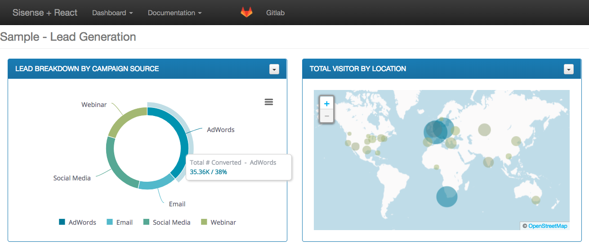

# Sisense.js Reactjs Sample

This project was generated with [create-react-app](https://github.com/facebook/create-react-app#creating-an-app) version 1.5.2.  The goal is to show a basic integration of Sisense.js using ReactJS. When you load the application, it makes some API calls to fetch all Sisense dashboards whose title are prefixed with *Sample* and adds option to the dropdown list.  Upon selection of a dashboard (uses the first result as default), the application loads the widgets from that dashboard onto the page.  For simplifity, certain widget types are excluded from display (textbox and indicator widgets)

### Dashboard
The application gets most of the widgets for a given dashboard and displays them on the page.  The end user can click to download each widget, as either an image or CSV

## Configuration

In order to setup this application for your Sisense server, check out the configuration file at */src/config/sisense.js*.  This file contains some settings, such as the dashboard title prefix, your Sisense server's address, etc that you may want to update before running.

## Development server

Run `npm start` to build and run the application, then navigate to `http://localhost:3000/`. The app will automatically reload if you change any of the source files.

## Production server

Run `npm run build` to generate a production build out of the application.  Once built, you can deploy the web app to a web server, as per [Instructions from React](https://github.com/facebook/create-react-app/blob/master/packages/react-scripts/template/README.md#deployment)

## Further help

To get more help on create-react-app for ReactJS check out the [Github Repository](https://github.com/facebook/create-react-app/blob/master/packages/react-scripts/template/README.md).

For more help with Sisense.js, check out the Sisense documentation [here](https://developer.sisense.com/display/API2/SisenseJS).